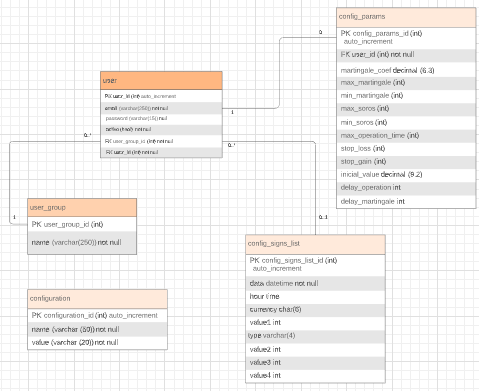

# Backend

## Database

## Entity Eelationship Diagram

[Entity Relationship Diagram](https://www.lucidchart.com/documents/edit/80069100-10c0-4ebb-9537-fd4ad7269e16/0_0?beaconFlowId=BE675978C06B965B)

## Generate .exe (deprecated)
Type `pyinstaller -F --noupx C:/projects/trader-robot/backend/app.py`  
The installer will be located on _Dist_ folder
 
[Deploying a Flask Application to Heroku](https://stackabuse.com/deploying-a-flask-application-to-heroku/)
[Deploy to Production](https://flask.palletsprojects.com/en/1.1.x/tutorial/deploy/)
[Using PyInstaller to Easily Distribute Python Applications](https://realpython.com/pyinstaller-python/)
[electron-python-example](https://github.com/fyears/electron-python-example)
[Unpack Python Exe Files](https://www.youtube.com/watch?v=jmC-FKNRdvk)

## Heroku Timezone 
[Change the time zone on a Heroku app](https://dev.to/paulasantamaria/change-the-timezone-on-a-heroku-app-2b4)
`heroku config:add TZ="America/Sao_Paulo" --app=trader-robot`
## Debug
To debug, uncomment `app.run(port=5000, debug=True)` on `app.py` file and set `breakpoint()` where do you want to inspect